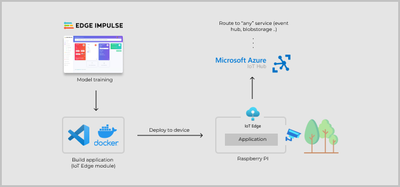
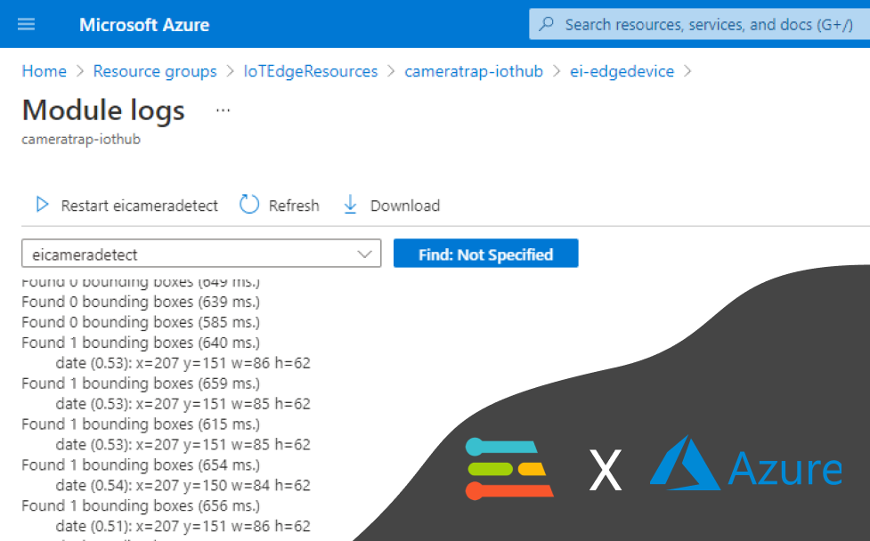
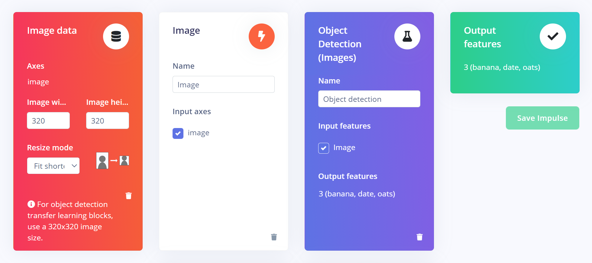
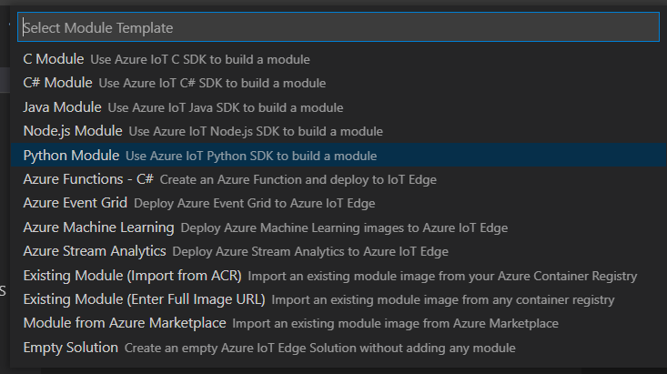
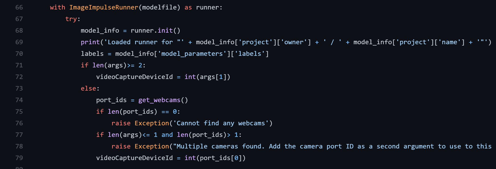
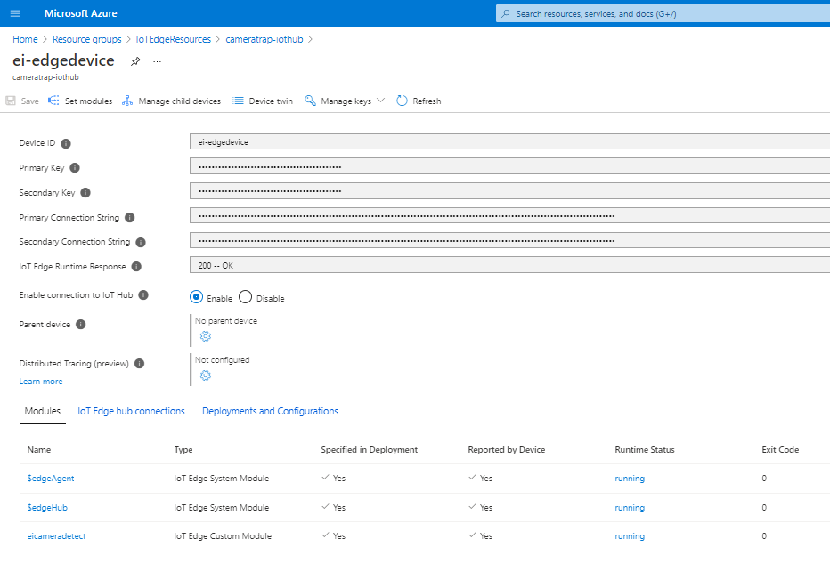
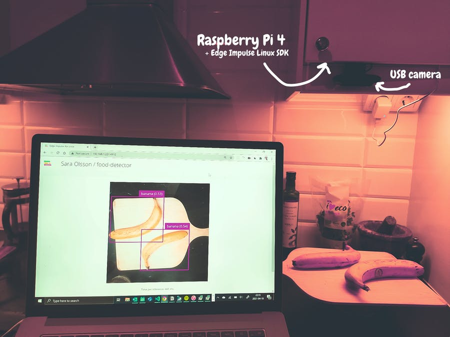
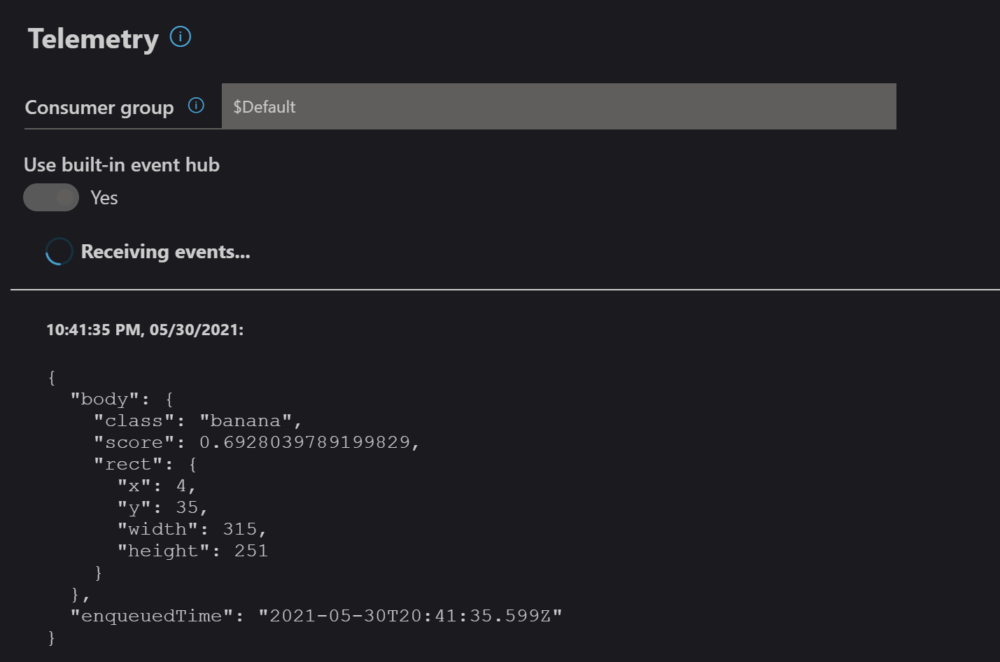

# edgeimpulse-on-iotedge

This guide help you to combine to great tools:  
✅ Edge Impulse and ✅ Azure IoT Edge

Topics covered:
- Build TinyML model with Edge Impulse
- Use *Linux CLI for Edge Impulse* and download model 
- Create an IoT Edge solution in Visual Studio Code
- Create a Python application that uses model (Linux Python SDK) and sends telemetry to Azure IoT Hub
- Build Docker image to encapsulate the application and all dependencies
- Prepare Raspberry Pi device to run IoT Edge and deploy solution



### Why IoT Edge?

Edge Impulse is now avaliable on Linux along with SDKs for Node.js, Python, Go and C++. For scenarios when you want to make use of your application on a bigger scale, Azure IoT Edge might be an intresting option to deploy it.

Some pros:
- Application and dependencies goes in the Docker image. 
- Whole application and/or runtime parameters can be updated OTA
- Possible to deploy to many devices at once
- Easy integration with various services (Event Hub, Storage, etc)


<!--  -->

<!-- Modelfile is about 20 MB. -->

# Build model with Edge Impulse

note: *This guide focus on object detection, however it can be tweaked to run image classification instead*

Sign up for an [account on Edge Impulse](https://studio.edgeimpulse.com/) and choose the option to build a model for object detection.
You can collect data from development boards, from your own devices, or by uploading an existing dataset. Read more about [the data forwarder](https://docs.edgeimpulse.com/docs/cli-data-forwarder) or view the list of fully supported development boards [here](https://docs.edgeimpulse.com/docs/fully-supported-development-boards). 

For detailed and updated instructions, follow [this guide in the Edge Impulse documentation](https://docs.edgeimpulse.com/docs/object-detection) to create a model for Object Detection. 

At the Impulse design tab, the steps for input data processing, training block, and output features are set. An impulse takes raw data, uses signal processing to extract features, and then uses the training block (the neural network) to classify the data. Based on project settings, suitable blocks will be suggested and in this case, object detection is used. I used the model *MobileNetV2 SSD FPN-Lite 320x320* which supports RGB images with 320x320 pixels.
Go throuh each step to start the training and then a good idea is to test the model at the Live classification page. Finally, go to the Deployment page and pick Linux go find out how to download your model.



# Download model with Linux CLI

With the Linux CLI for Edge Impulse, it is possible to aquire data as well as to run the resulting model. That is, you might already used it when collecting data for the model in the first step. However now we just want to fetch the modelfile, and a way to do it is by installing the [Edge Impulse for Linux CLI](https://docs.edgeimpulse.com/docs/edge-impulse-for-linux) (choose Raspberry Pi 4) and download model by running the following in the terminal:  
``` $ edge-impulse-linux-runner --download modelfile.eim ```
Later on, we will use the model along with an Edge Impulse SDK, however the SDK will be installed to the Docker image where the application runs.


# Create an IoT Edge solution in Visual Studio Code

Let's create the application project! Open up VS Code and install the extension Azure IoT Tools.
Then, run the Command Palette (Ctrl+Shift+P) to easy access the extension commands and search for the option  ```Azure IoT Edge: New IoT Edge Solution```. Enter a container registry* for your modules and then you will have the option to create your first module. Pick *Python module* and you will be provided a template application that listen for messages on the edge broker and forwards them. In short, the deployment template defines what modules should run on the device, what Docker and application settings they have, and how they communicate with each other. Two system modules are always included, and by default there is an example module that publishes simulated temperature data. 
 
 
 *Azure Container Registry is a convinent option. You may also use localhost for development purpose. Read more about how to use Visual Studio Code to develop and debug modules for Azure IoT Edge [here](https://docs.microsoft.com/en-us/azure/iot-edge/how-to-vs-code-develop-module?view=iotedge-2020-11).



# Create a Python application

The application code is based on the [Image example](https://github.com/edgeimpulse/linux-sdk-python/blob/master/examples/image/classify.py) in the repository of Edge Impulse Linux SDK for Python. Comparing the files, you will notice that I have also included the Azure IoT client to send telemetry data to the IoT Hub or another module.

TODO: refactor main.py  
TODO: add enviroment variables to justify capture rate, scoring threshold value etc.



# Build Docker image

This may be the tricky part, to come up with a Docker file that encapsulate all dependencies for the Azure IoT client, Edge Impulse as well as OpenCV for camera capture and image processing.

👋 NOTE: Below I motivate for various package installations. However, I do provide a Dockerfile that is validated on a Raspberry Pi 4 and this information is targeted to someone who might want to adjust the Dockerfile.


From instructions on installing Edge Impulse Linux SDK for Python:

```
$ sudo apt-get install libatlas-base-dev libportaudio0 libportaudio2 libportaudiocpp0 portaudio19-dev 
$ pip3 install edge_impulse_linux -i https://pypi.python.org/simple
 ```

For OpenCV dependencies, I took inspiration from the Azure sample [Custom Vision + Azure IoT Edge on a Raspberry Pi 3](https://github.com/Azure-Samples/Custom-vision-service-iot-edge-raspberry-pi), and in particular [the Dockerfile](https://github.com/Azure-Samples/Custom-vision-service-iot-edge-raspberry-pi/blob/master/modules/CameraCapture/arm32v7.Dockerfile) for the camera capture module. (From here I also applied the cross-compilation, but it seems to build and run also without it)

```
# Required for OpenCV
RUN install_packages \
    # Hierarchical Data Format
    libhdf5-dev libhdf5-serial-dev \
    # for image files
    libjpeg-dev libtiff5-dev libjasper-dev libpng-dev \
    # for video files
    libavcodec-dev libavformat-dev libswscale-dev libv4l-dev \
    # for gui
    libqt4-test libqtgui4 libqtwebkit4 libgtk-3-0 \
    # libgtk2.0-dev eller libgtk-3-dev
    # high def image processing
    libilmbase-dev libopenexr-dev 
```

The next step is to install those Python packages you need in your application, and this step was provided in the original Dockerfile provided by the IoT Edge module template. In addition for the *azure-iot-device* package, I added the [requirements provided](https://github.com/edgeimpulse/linux-sdk-python/blob/master/requirements.txt) in the Edge Impulse repository for Linux SDK Python (sufficient for the image or audio example). You may want to add packages in requirements.txt.

```
COPY requirements.txt ./
RUN pip3 install -r requirements.txt
```

The last ``` COPY . . ``` copies the Python scripts as well as the modelfile.eim to the Docker image

# Prepare Raspberry Pi device to run IoT Edge


First, flash your Raspberry Pi 4 with Raspberry OS to an SD card with your favorite flashing tool, like Raspberry Imager or Balena. Then, prepare the device for headless usage by enabling SSH and setting WIFI credentials (or skip if you'll use an ethernet connection).

Secondly, install dependencies for IoT Edge runtime. Please follow the instructions in the [Microsoft documentation](https://docs.microsoft.com/en-us/azure/iot-edge/how-to-install-iot-edge?view=iotedge-2020-11).

Notes:
- A prerequisite is an Azure account with a free or standard IoT hub in your Azure subscription where you will create a new IoT Edge device.
- The easiest way to authenticate during development is *Option 1: Authenticate with symmetric keys*. That is, you copy the device connection string from your device in Azure IoT Hub to enter in the *config.toml* file in the Provisioning section.

## Deploy solution

By right-clicking on the file ``` deployment.template.json ``` in VS Code you will find the option to build and push your IoT Edge solution. Thereafter, you will find the generated file ``` deployment.arm32v7.json ``` has been created in a folder named *config*. Right-click and choose *Create deployment for single device*. Make sure you have completed the steps to create a container registry (like Azure Container Registry or Docker Hub), and you probably want to fill in the registryCredentials in the deployment template to authenticate towards the registry. 

After a successfull deployment, the device in Azure IoT Hub would look similar to this, where *eicameradetect* is the name of my custom module.



# Running solution

The images below illustrate how the solution may be set up. The website on the laptop screen is the XXX example from. However the resulting telemetry from the module may be used in various way. Learn more about telemetry routing and you can connect your data to custom websites, backend code like serverless Azure Functions etc.
In the Azure IoT Explorer software, it is possible to monitor the incloming telemetry.

TODO: provice example of routing telemetry to Event Hub


